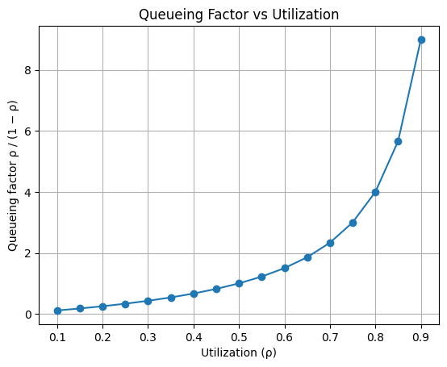
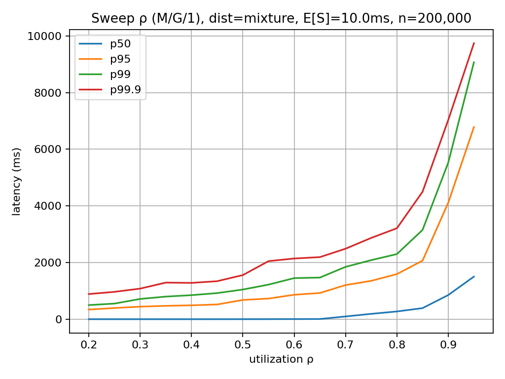
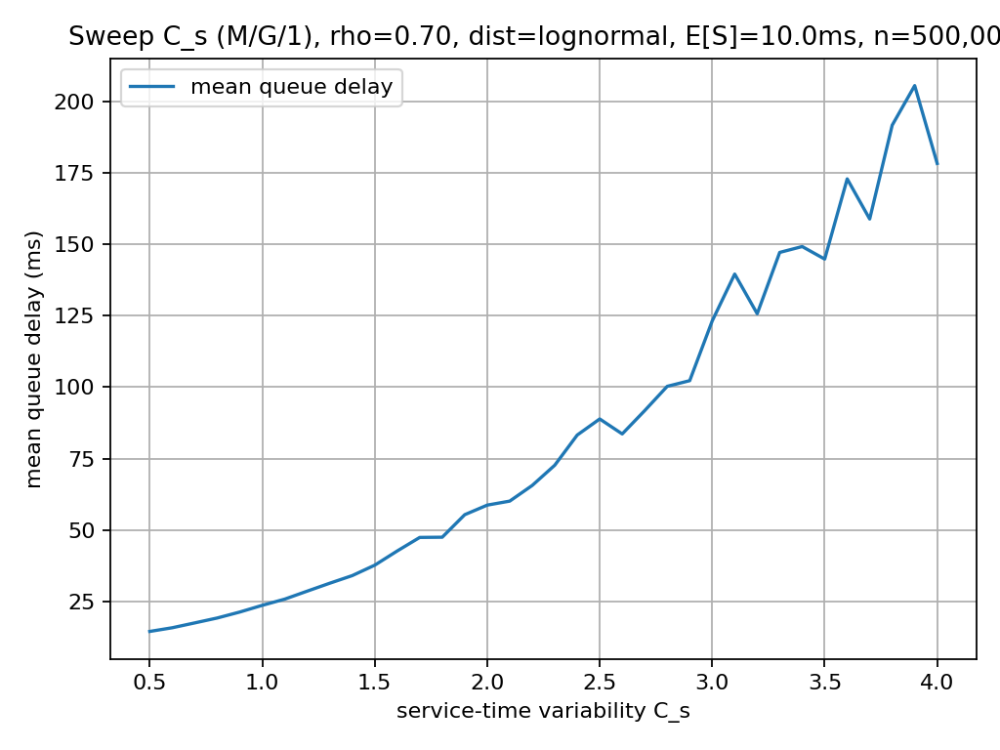
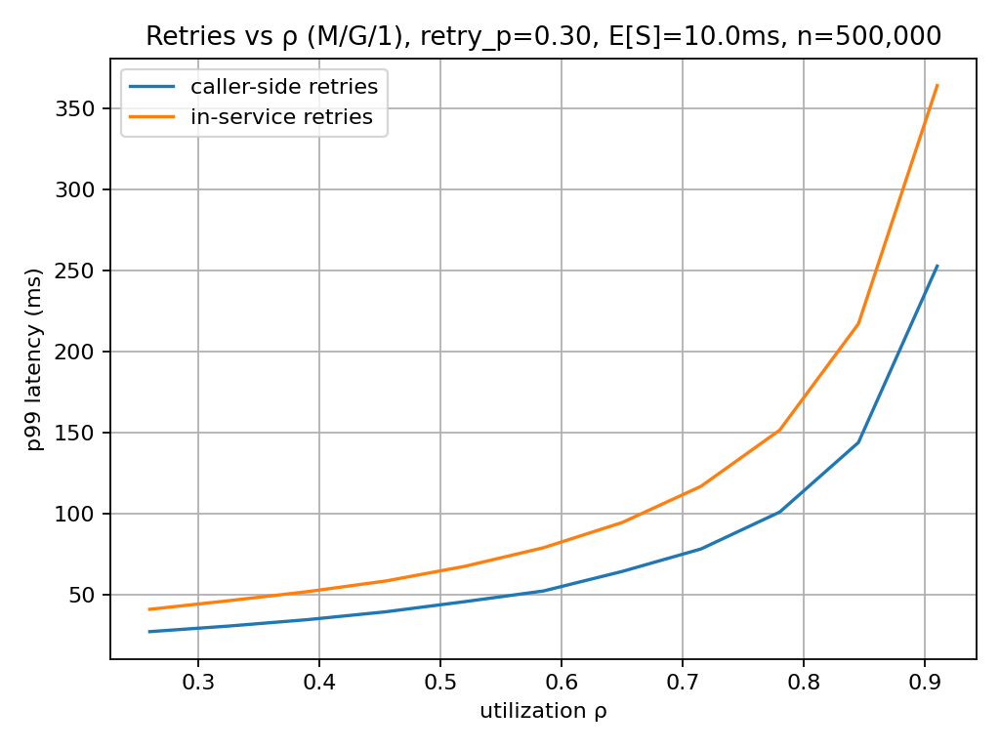

# Latency Variance Is Not a Bug

## It's the Price of Utilization

If you spend enough time on-call, you've heard the line:

> "Latency is noisy. Something is wrong. We need to lower utilization. Scale up!"

The intuition is understandable. When p95 and p99 wobble, we reach for the knob we can see: CPU. Many teams respond by keeping systems at 10-20% utilization, just to stay far away from queues.

This post makes a different claim:

> **Latency variance is not a defect.**
> **It is a mathematical consequence of utilization.**

Not only is it expected, it is predictable, quantifiable, and plannable.

## Utilization Is Not a Tuning Knob

Utilization is not something you dial in. It is an accounting identity.

If your system:

- Receives work at rate $\lambda$ (requests per second).
- Requires $E[S]$ CPU-seconds per request.

Then utilization is:

$$
\rho = \lambda E[S]
$$

That is not a choice. It is a consequence. You do not decide to run at 65% CPU any more than you decide that gravity exists today. If load increases or service time grows, utilization increases. Full stop.

The real choice is not *whether* there is utilization, but whether that utilization is **safe** or **dangerous**.

Safe utilization means short queues and predictable latency. Dangerous utilization means long queues and explosive tail latency. The difference is **variance**, not virtue.

## Why Variance Shows Up Even in Healthy Systems

Here is the uncomfortable truth:

> **Any system that shares a finite resource will exhibit queueing delay.**

If a system shares CPU, threads, or connections, runs at non-zero utilization, and sees non-zero variability, queues are inevitable. This is not a software problem. It is queueing theory.

The most useful tool we have for reasoning about this in real systems is **Kingman's approximation**.

## Kingman's Formula (The One You Actually Need)

Kingman's approximation estimates the **mean waiting time in queue** for a broad class of systems (GI/G/1):

$$
E[W_q]
\;\approx\;
\frac{\rho}{1 - \rho}
\cdot
\frac{C_a^2 + C_s^2}{2}
\cdot
E[S]
$$

Where:

- $\rho = \lambda E[S]$ is utilization.
- $E[S]$ is mean service time.
- $C_a^2$ is arrival-time variability.
- $C_s^2$ is service-time variability.

Kingman's formula is an *approximation* that is asymptotically exact as $\rho\rightarrow 1$, and it applies to the GI/G/1 queue:

| Component | Meaning                                 |
|-----------|-----------------------------------------|
| GI        | General inter-arrival time distribution |
| G         | General service time distribution       |

In plain English: it's the mean waiting time for a single-server system where interarrival and service times can be broadly distributed (not necessarily exponential).

So, this model covers **many** practical systems:

- Many arrival distributions (Poisson, bursty, scheduled), as long as interarrival times are i.i.d. with finite variance (no infinite-variance tails).
- Many service distributions (constant, log-normal, normal), as long as service times are i.i.d. with finite variance (no infinite-variance tails).

It is empirically accurate across a wide range of bottlenecks:

- CPUs.
- Thread pools.
- Database connections.
- Message consumers.

In other words: **most backend bottlenecks**.

## The Concept We're Really Talking About

Before we go further, let's name the phenomenon we keep feeling in production.

*Latency inflation* is when **observed latency** (what the customer sees) is much larger than the service time (how long the code actually runs). The gap between the two is latency inflation caused by *queueing*.

Kingman's law gives us a way to reason about that gap without pretending our world is exponential.

> Latency inflation is not about slow code: it is about **waiting** before the code gets to run.

When we ignore this, we tend to swing between two bad instincts:

- **Overconfidence:** "Average latency is low, we're fine".
- **Overcompensation:** "Variance is scary, let's scale up and keep utilization low".

Both are expensive. Kingman gives us a third path: **quantitative realism**.

## What Kingman's Law Really Says

This is dense, so let's rephrase it in plain English:

$$
\text{Queueing delay} \propto \frac{\rho}{1 - \rho} \cdot (\text{arrival variability} + \text{service variability}) \cdot \text{average service time}
$$

There are three terms. Three unavoidable facts. Three levers. And only **one** of them is under direct operational control.

1. **Utilization creates non-linear latency increase.** As $\rho\rightarrow 1$, *sensitivity* to variance explodes; with zero variance, a deterministic queue has zero waiting for $\rho<1$ but becomes fragile at $\rho=1$.
2. **Variance amplifies waiting times.** Variance doesn't create queues, it magnifies them once utilization is high.
3. **Latency variance is not a bug.** It is a mathematical consequence of shared resources and utilization. You can only remove it by:
   - Overprovisioning.
   - Making arrivals and service times deterministic (unrealistic).
   - Eliminating shared resources (also unrealistic).

## The Curve We All Rediscover the Hard Way

The most important term is this one:

$$
\frac{\rho}{1 - \rho}
$$

It grows slowly... until it doesn't.

| Utilization | Queueing factor |
|-------------|-----------------|
| 0.10        | 0.11            |
| 0.20        | 0.25            |
| 0.30        | 0.43            |
| 0.40        | 0.67            |
| 0.50        | 1.00            |
| 0.55        | 1.22            |
| 0.60        | 1.50            |
| 0.65        | 1.86            |
| 0.70        | 2.33            |
| 0.75        | 3.00            |
| 0.80        | 4.00            |
| 0.85        | 5.67            |
| 0.90        | 9.00            |

This is why:

- 60–70% feels fine.
- 70–80% feels scary.
- 80–90% feels like a cliff.

Nothing broke. **The math just became visible.**

A look at the plotted values for $\rho/(1-\rho)$ also shows why a common utilization target is 60–70%, right at the elbow after the end of the linear zone.

## "But Our p99 Exploded!"

Yes. Of course it did.
Kingman's law estimates the *mean*, but queueing does not politely stay in the mean. Its effects show up first in the tail:

- Stretching the right tail.
- Amplifying bursts.
- Punishing long service times.

That is why:

- p99 degrades before p50 looks bad.
- Tail latency becomes noisy under load.
- Systems "feel flaky" **long** before averages move.

The following picture shows the behavior of various percentiles during a utilization sweep from 0.2 to 0.9 for a bimodal (rare-slow) service time distribution where $E[S]=10$ ms, with 200,000 requests simulated. When $\rho=0.6$:

- The p50 barely moves from $E[S]=10$ ms.
- The p99 skyrockets to $140\cdot E[S]$.

This is not a failure of the model. It is exactly what the model predicts.

> **Tail latency is a utilization problem, not a mystery.**

## Numeric Example: The Cost of Utilization

Let's put numbers on this. Assume a single bottleneck (one CPU core, one DB connection, one worker).

**Note:** These values are mean queueing delays computed from Kingman's approximation, not a simulation.

From production measurements:

- Mean service time: $E[S] = 20$ ms.
- Standard deviation: $\sigma = 20$ ms.

So service-time variability is:

$$
C_s^2 = \left(\frac{20}{20}\right)^2 = 1
$$

Arrivals are bursty (very normal in real systems):

$$
C_a^2 = 2.25
$$

### What happens as utilization increases?

| Utilization | Throughput (req/s) | Mean queue wait | Mean total latency |
|-------------|--------------------|-----------------|--------------------|
| 0.20        | 10.0               | 8.1 ms          | 28.1 ms            |
| 0.50        | 25.0               | 32.5 ms         | 52.5 ms            |
| 0.70        | 35.0               | 75.8 ms         | 95.8 ms            |
| 0.80        | 40.0               | 130.0 ms        | 150.0 ms           |
| 0.85        | 42.5               | 184.2 ms        | 204.2 ms           |

At 80% utilization, the *queue* dominates the latency. Nothing is broken. **This is the expected cost of efficiency.**

## Same Load, Same Utilization: Different Variance

At 70% utilization:

| Service variability $C_s^2$ | Interpretation         | Mean total latency |
|-----------------------------|------------------------|--------------------|
| 0.25                        | Stable service         | 78 ms              |
| 1.00                        | Typical mixed workload | 96 ms              |
| 4.00                        | Heavy-tailed service   | 166 ms             |

Variance is not evil. **But it is not free.**

Here is the same idea shown as a sweep over $C_s$ (the coefficient of variation). We hold $\rho = 0.70$ and $E[S]=10$ ms fixed, and measure mean queue delay as service-time variability increases. The jitter in the curve is real Monte Carlo noise from the simulation, and it is part of the story: even the *mean* gets tugged around once tails get heavy.

## Retries: Variance Multipliers in Disguise, and Where They Happen Matters

Retries feel safe. Mathematically, they are **gasoline**. But "retries" is really two different mechanisms with different queueing effects.

### Caller-side retries (new arrivals)

When a client times out and sends another request, the system observes a **new arrival**.

From the queue's perspective:

- The arrival rate $\lambda$ increases.
- Arrivals become burstier.
- Arrival-time variance $C_a^2$ grows.

Even if each client's retry logic is deterministic, retries often **synchronize at the system level**: many callers observe the same slowdown and retry at the same time. That correlation is what makes retry storms so destructive.

This is why exponential backoff and jitter are not "nice to have". They break correlation and keep arrival variability bounded.

### In-service retries (longer service times)

When a service retries work *inside* the request handling path, no new arrival is created, but the **service time increases**.

From the queue's perspective:

- The mean service time $E[S]$ grows.
- The service-time variance $C_s^2$ widens.
- Long requests block everything behind them.

This manifests as heavier tails and p99 inflation even when arrivals are smooth.

### Where determinism fits in

Determinism does not eliminate cost; it **bounds** it.

- Deterministic retries cap variance.
- Correlated or unbounded retries amplify it.

A useful rule of thumb:

> **Retries outside the queue attack arrivals.**
> **Retries inside the queue stretch the tail.**

Kingman's law does not forbid retries. It just tells you **which bill they add to**.

To make this concrete, I simulated a toy comparison with $\rho$ swept and a 10% retry probability. Caller-side retries are modeled as 10% more arrivals; in-service retries are modeled as a 10% chance of doing the same work twice, so the mean utilization increase matches. The curves are close, which is the point: even a "fair" comparison produces a noticeable tail penalty.

This picture is likely an *underestimate* of real service-side impact. Real in-service retries often cost more than the original attempt, and real systems add extra variance (cache misses, downstream contention, I/O jitter) that make the tail fatter than this clean model.

> This explains why, in general, we want to **shed load** at the server-side and implement **retry** logic at the client-side.

## Thread Pools vs Async: Physics Still Applies

Async systems do not eliminate queueing. They relocate it.

- Thread pools have visible queues.
- Async systems have implicit queues (buffers, schedulers, event loops).

Kingman's law applies equally to blocking threads, asynchronous pipelines, coroutines, and virtual threads. If a resource is finite and shared, it queues. Full stop.

> **Async changes how you pay for waiting, not whether you pay.**

## Capacity Planning Without Superstition

A sane capacity-planning loop looks like this:

1. Identify the bottleneck.
2. Measure mean service time.
3. Measure arrival and service variability.
4. Pick a utilization target intentionally.
5. Decide whether the resulting latency is acceptable.

Not:

> "Let's stay under 20% CPU".

But:

> "At 75% utilization, expected queueing delay is 3× service time. Is that acceptable?"

That is engineering.

If you want to apply this with real telemetry, see the practical appendix at the end for a worked path from percentiles to $C_s^2$.

## The Cultural Shift This Enables

Once teams internalize this:

- Utilization stops being scary.
- Variance stops being shameful.
- Latency becomes explainable.

You move from:

> "Why is prod flaky?"

to:

> "We're at 78% utilization with high variance. This is expected".

That is not lowering standards. It is raising understanding.

## Final Thought

Latency variance is not a sign that your system is broken.

It is a sign that your system is **alive, shared, and doing useful work**.

The goal of engineering is not to eliminate variance. Our job is to understand it well enough that it stops surprising us.

When variance surprises you, you page people. When it doesn't, you plan.

That difference is not tooling. It is literacy.

## Practical Appendix: Estimating Variability from Percentiles

Up to this point, we’ve argued that **latency variance is expected** and that queueing delay is driven by **utilization multiplied by variability**.

That argument only becomes operational once we can estimate the inputs — and in production, this is where things get uncomfortable.

In real systems, we rarely observe full service-time distributions. What we usually have are **percentiles** (P50, P95, P99) exported by telemetry systems. Turning those into something usable for queueing analysis requires care, humility, and explicit assumptions.

## A Common Notation Trap: $C_s$ vs. $C_s^2$

The coefficient of variation of service time $S$ is defined as:

$$
C_s = \frac{\sigma}{\mu}
$$

where:

- $\mu = E[S]$ is the mean service time  
- $\sigma = \sqrt{\mathrm{Var}(S)}$ is the standard deviation  

Kingman’s formula, however, uses the **squared** coefficient of variation:

$$
\boxed{
C_s^2 = \frac{\mathrm{Var}(S)}{E[S]^2} = \left(\frac{\sigma}{\mu}\right)^2
}
$$

This is not a cosmetic detail. Queueing delay scales with **variance**, not standard deviation. Confusing $C_s$ with $C_s^2$ systematically underestimates waiting time — often by a large factor.

## Percentiles Are Not Variance

With only percentiles:

- There is **no distribution-free way** to recover variance
- Many radically different distributions can share the same P50 and P99
- Queueing behavior can differ by orders of magnitude

Any attempt to estimate $C_s^2$ from percentiles therefore requires a **modeling assumption**.

This is not a flaw — Kingman itself is an approximation. What matters is being explicit about the assumption instead of pretending the data is richer than it is.

## A Pragmatic Default: Log-Normal Service Times

For many RPC-style services, a log-normal distribution is a reasonable first-order model:

- Strictly positive support  
- Naturally right-skewed  
- Captures moderate tail behavior without infinite variance  

Assume:

$$
S \sim \mathrm{LogNormal}(\mu_{\ln}, \sigma_{\ln}^2)
$$

Then:

- Median:
  $$
  P50 = e^{\mu_{\ln}}
  $$

- 99th percentile:
  $$
  P99 = e^{\mu_{\ln} + \sigma_{\ln} z_{0.99}}, \quad z_{0.99} \approx 2.326
  $$

From observed percentiles:

$$
\sigma_{\ln} = \frac{\ln(P99) - \ln(P50)}{2.326}
$$

## From Percentiles to $C_s^2$ (and Why This Matters)

For a log-normal distribution:

$$
\boxed{
C_s^2 = e^{\sigma_{\ln}^2} - 1
}
$$

The mean service time is:

$$
E[S] = P50 \cdot e^{\sigma_{\ln}^2 / 2}
$$

Two important implications:

1. **$E[S]$ is almost always larger than P50**  
   Using P50 directly in utilization calculations underestimates $\rho$.

2. **Small percentile spreads imply low variability**  
   A modest P99/P50 ratio often corresponds to near-deterministic service.

## Worked Example

Given:

$$
P50 = 5,\quad P99 = 9
$$

We estimate:

$$
\sigma_{\ln} \approx 0.25
$$

$$
C_s^2 \approx e^{0.25^2} - 1 \approx 0.066
$$

$$
E[S] \approx 5 \cdot e^{0.25^2 / 2} \approx 5.16
$$

This corresponds to **very low service-time variability**, much closer to deterministic or high-order Erlang behavior than to exponential service.

A quick log-normal sanity check:

$$
\frac{P99}{P50} = 1.8 \;\Rightarrow\; \text{low variability}
$$

## Why Variability Barely Matters — Until It Suddenly Does

Kingman’s structure explains a common operational surprise:

- At low utilization, variability barely shows up
- Near saturation, *even modest variability dominates latency*

The amplification term:

$$
\frac{\rho}{1-\rho}
$$

does not forgive optimism. As utilization rises, variance that was previously invisible becomes decisive.

This is why systems often appear healthy — until they very abruptly are not.

## Telemetry Caveats (Datadog and Similar Systems)

When estimating variability from production percentiles, several caveats apply:

1. **Aggregated percentiles are not per-request percentiles**  
   Host-level percentiles aggregated across instances compress tails.

2. **Time-windowing smooths burstiness**  
   Rolling windows hide short-term correlation and inflate apparent regularity.

3. **Timeouts and clipping truncate tails**  
   Hard cutoffs bias variance downward.

4. **Cross-instance mixing masks heterogeneity**  
   Fast and slow instances average out, while queues still experience the full variance.

As a result, percentile-derived $C_s^2$ values should be treated as **lower bounds**, not precise measurements.

## Practical Guidance

- Percentiles alone are insufficient; assumptions must be explicit
- Log-normal service times are a defensible default when data is sparse
- Always estimate:
  - $E[S]$, not just P50
  - $C_s^2$, not just utilization
- One additional percentile (P90 or P95) dramatically improves confidence

## Key Takeaway

> **Latency tails hurt you indirectly: through variability, and variability hurts you through queues.**

The hardest part of applying queueing theory in production is not the math.  
It is being honest about what our telemetry does — and does not — tell us.
